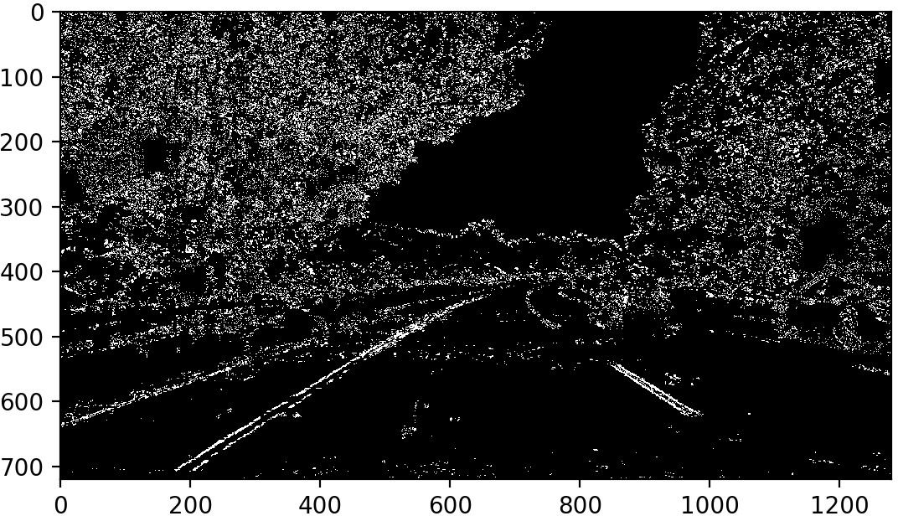

## Writeup

---

**Advanced Lane Finding Project**

The goals / steps of this project are the following:

* Compute the camera calibration matrix and distortion coefficients given a set of chessboard images.
* Apply a distortion correction to raw images.
* Use color transforms, gradients, etc., to create a thresholded binary image.
* Apply a perspective transform to rectify binary image ("birds-eye view").
* Detect lane pixels and fit to find the lane boundary.
* Determine the curvature of the lane and vehicle position with respect to center.
* Warp the detected lane boundaries back onto the original image.
* Output visual display of the lane boundaries and numerical estimation of lane curvature and vehicle position.

[//]: # (Image References)

[image1]: ./examples/undistort_output.png "Undistorted"
[image2]: ./test_images/test1.jpg "Road Transformed"
[image3]: ./examples/binary_combo_example.jpg "Binary Example"
[image4]: ./examples/warped_straight_lines.jpg "Warp Example"
[image5]: ./examples/color_fit_lines.jpg "Fit Visual"
[image6]: ./examples/example_output.jpg "Output"
[video1]: ./project_video.mp4 "Video"

## [Rubric](https://review.udacity.com/#!/rubrics/571/view) Points

### Here I will consider the rubric points individually and describe how I addressed each point in my implementation.  

---

### Camera Calibration

#### 1. Briefly state how you computed the camera matrix and distortion coefficients. Provide an example of a distortion corrected calibration image.

The code for calibrating the camera is located in [calibrate_camera.py](calibrate_camera.py).

I start by preparing "object points", which will be the (x, y, z) coordinates of the chessboard corners in the world.
Here I am assuming the chessboard is fixed on the (x, y) plane at z=0, such that the object points are the same for each
calibration image.  Thus, `objp` is just a replicated array of coordinates, and `objpoints` will be appended with a copy
of it every time I successfully detect all chessboard corners in a test image.  `imgpoints` will be appended with the
(x, y) pixel position of each of the corners in the image plane with each successful chessboard detection. Some images
could not be used because not all chessboard corners could be found, so they were skipped during the calibration process:

```
chessboard corners not found for camera_cal/calibration1.jpg
chessboard corners not found for camera_cal/calibration4.jpg
chessboard corners not found for camera_cal/calibration5.jpg
```

I then used the output `objpoints` and `imgpoints` to compute the camera calibration and distortion coefficients using the `cv2.calibrateCamera()` function.  I applied this distortion correction to the test image using the `cv2.undistort()` function and obtained this result: 


In order to reuse the camera calibration later I stored the calibration data into a file [wide_dist_pickle.p](wide_dist_pickle.p).

### Pipeline (single images)

#### 1. Provide an example of a distortion-corrected image.

To demonstrate this step, I will describe how I apply the distortion correction to one of the test images like this one:


The code is straight-forward. I wrote a function to load the first frame of a video and a function to undistort an image
using the calibration data of the previously generated file:

```python
def load_first_image_of_video(video_file):
    """Returns the first image of a video"""
    cap = cv2.VideoCapture(video_file)
    ret, frame = cap.read()
    if ret:
        cap.release()
        return frame
    else:
        exit('unable to read video ' + video_file)


def load_camera_calibration(file='wide_dist_pickle.p'):
    """Loads the camera calibration"""
    return pickle.load(open(file, 'rb'))


def undistort(image, calibration):
    """Corrects a distorted image"""
    return cv2.undistort(image, calibration['mtx'], calibration['dist'], None, calibration['mtx'])
```

Now I can undistort the image like this:

```python
calibration = load_camera_calibration()
sample = load_first_image_of_video('project_video.mp4')
undistorted = undistort(sample, calibration)
```

#### 2. Describe how (and identify where in your code) you used color transforms, gradients or other methods to create a thresholded binary image.  Provide an example of a binary image result.

By visualizing the test images in all 6 channels of the RGB and HLS color formats, I found out that the most useful
channels would be red and green of RGB and the saturation channel of HLS. I decided to use the red and saturation channels to
move forward. Due to how OpenCV handles images I had to spend extra care on the order of the colors, which is BGR in OpenCV.
 
I computed the magnitude gradient `np.sqrt(sobelx ** 2 + sobely ** 2)` and combined it with the gradient direction `np.sqrt(np.square(sobelx) + np.square(sobely))`, of which I selected certain thresholds - similarly for both the red and saturation channels:

```python
def get_line_mask(undistorted):
    red = bgr2red(undistorted)
    magnitude_red = magnitude_treshold(red, thresh=(20, 100))
    direction_red = direction_treshold(red, thresh=(0.7, 1.3))
    red_mask = mask1_and_mask2(magnitude_red, direction_red)

    saturation = bgr2saturation(undistorted)
    magnitude_saturation = magnitude_treshold(saturation, thresh=(40, 100))
    direction_saturation = direction_treshold(saturation, thresh=(0.7, 1.3))
    saturation_mask = mask1_and_mask2(magnitude_saturation, direction_saturation)
    
    mask = mask1_or_mask2(red_mask, saturation_mask)

    return mask
```

Here are some examples of how the final binary mask looks like:





#### 3. Describe how (and identify where in your code) you performed a perspective transform and provide an example of a transformed image.

In order to perform a perspective transformation I took the undistorted image of [straight_lines1.jpg](test_images/straight_lines1.jpg)
and opened it in GIMP to select the edges of a polygon. I then drew it on the image using OpenCV to visually check whether the polygon
was correctly placed around the lines.

Then I warped the image using the following code:

```python
def get_perspective_transform_src(image_width=1280, image_height=720):
    top = 454
    top_left = 588
    top_right = 694
    bottom_right = 1117
    bottom_left = 194
    height = image_height - top

    vertices = np.float32([[
        (bottom_left, image_height),  # bottom left
        (top_left, top),  # top left
        (top_right, top),  # top right
        (bottom_right, image_height)  # bottom right
    ]])
    return vertices, height


def get_perspective_transform_dst(image_width=1280, image_height=720):
    left = 300
    right = image_width - left

    vertices = np.float32([[
        (left, image_height),  # bottom left
        (left, 0),  # top left
        (right, 0),  # top right
        (right, image_height)  # bottom right
    ]])
    return vertices
    


# …later in pipeline function:
    src, src_height = get_perspective_transform_src()
    dst = get_perspective_transform_dst()
    M = cv2.getPerspectiveTransform(src, dst)
    # matrix used for warping back
    Minv = cv2.getPerspectiveTransform(dst, src)
    img_size = image_size(image)
    warped = cv2.warpPerspective(mask, M, img_size, flags=cv2.INTER_LINEAR)
```

I verified that my perspective transform was working as expected by drawing the `src` and `dst` points onto a test image
and its warped counterpart to verify that the lines appear parallel in the warped image.


And here is how the mask was transformed:


#### 4. Describe how (and identify where in your code) you identified lane-line pixels and fit their positions with a polynomial?

Using a histogram of the lower part of the warped image, I identified where the lane lines as peaks of a histogram:


Using a sliding window approach, starting at the bottom of the image, I selected one window for each peak. Then I moved
the window to the next position nearby where the binary mask matched. That way I found the (x,y) pairs of pixels
belonging to the left and the right line. Using `np.polyfit(y, x, 2)` I then could fit a 2nd degree polynomial to the
points.
The code can be found in the `detect_lines` function in [pipeline.py](pipeline.py).

Here are three examples (sliding windows green, left line pixels blue, right line pixels red, fitted polynomials yellow):


#### 5. Describe how (and identify where in your code) you calculated the radius of curvature of the lane and the position of the vehicle with respect to center.

Using the method above I was able to find out the curve radius and distance to the lane center in pixels.
Here is how I calculated the distance of the vehicle to the center of the lane, in metric units:

```python
    # Define conversions in x and y from pixels space to meters
    ym_per_pix = 30 / 720  # meters per pixel in y dimension
    xm_per_pix = 3.7 / 700  # meters per pixel in x dimension

    # Find out how many meters the left/right lines are away from the center
    left.line_base_pos = (width / 2 - leftx_base) * xm_per_pix
    right.line_base_pos = (rightx_base - width / 2) * xm_per_pix
    
    center_distance = (right.line_base_pos - left.line_base_pos) / 2
```

And here is how I calculated the real-world radius of the curves:

```python
    # Generate x and y values for plotting
    ally = np.linspace(0, height - 1, height)
    left.ally = right.ally = ally
    left.allx = left.get_poly()
    right.allx = right.get_poly()

    y_eval = np.max(ally)

    # Fit new polynomials to x,y in world space
    left_fit_cr = np.polyfit(ally * ym_per_pix, left.allx * xm_per_pix, 2)
    right_fit_cr = np.polyfit(ally * ym_per_pix, right.allx * xm_per_pix, 2)
    # Calculate the new radii of curvature
    left.radius_of_curvature = ((1 + (2 * left_fit_cr[0] * y_eval * ym_per_pix + left_fit_cr[1]) ** 2) ** 1.5) \
                               / np.absolute(2 * left_fit_cr[0])
    right.radius_of_curvature = ((1 + (2 * right_fit_cr[0] * y_eval * ym_per_pix + right_fit_cr[1]) ** 2) ** 1.5) \
                                / np.absolute(2 * right_fit_cr[0])
    
    radius = (left.radius_of_curvature + right.radius_of_curvature) / 2
```

#### 6. Provide an example image of your result plotted back down onto the road such that the lane area is identified clearly.

Also, to draw the detected lane on the final image, the points of a line are generated by applying the 2nd degree polynomial
to a set of `y = [0..720[`. The corresponding (x,y) points are later used to draw the polygon on a warped image and
are warped back on the undistorted source image, leading to a result like this:


The corresponding code can be found at the end of the pipeline function in [pipeline.py](pipeline.py).
Important code bits:

```python
# Create an empty image to draw the polygon on
warp_zero = np.zeros_like(binary_warped).astype(np.uint8)
color_warp = np.dstack((warp_zero, warp_zero, warp_zero))

# Recast the x and y points into usable format for cv2.fillPoly()
pts_left = np.array([np.transpose(np.vstack([left_average.allx, left_average.ally]))])
pts_right = np.array([np.flipud(np.transpose(np.vstack([right_average.allx, right_average.ally])))])
pts = np.hstack((pts_left, pts_right))

# Draw the lane onto the warped blank image
cv2.fillPoly(color_warp, np.int_([pts]), (0, 255, 0))

# Warp polygon back to original coordinates, draw on undistorted image
newwarp = cv2.warpPerspective(color_warp, Minv, image_size(undistorted))
result = cv2.addWeighted(undistorted, 1, newwarp, 0.3, 0)
```

---

### Pipeline (video)

#### 1. Provide a link to your final video output.  Your pipeline should perform reasonably well on the entire project video (wobbly lines are ok but no catastrophic failures that would cause the car to drive off the road!).

Here's a [link to my video result](./project_video_detected_lanes.mp4).

---

### Discussion

#### 1. Briefly discuss any problems / issues you faced in your implementation of this project.  Where will your pipeline likely fail?  What could you do to make it more robust?

My biggest issue with this project was deciding which color channels to use and especially which features of the gradients
I should pick for creating the mask. There are absolute x and y gradients, the magnitude and the gradient direction, and their
parameters to choose from: Minimum and maximum thresholds as well as Sobel kernel size. Finally, these can be combined in
even more ways. After playing around only with the saturation I decided to use both the red and the saturation channel,
and stick to gradient magnitude and direction. The created masks still contained a lot of noise. This problem alone –
deciding where the lines are in an image – is something where I would like to apply more power, i.e. using machine
learning.

All the other parts of the project were pretty much straightforward:

- Camera Calibration
- Removing distortion from original image
- Warping into birds-eye view
- Histogram and Sliding Window algorithm
- Fitting the polynomials
- Calculating curve radius / distance from center
- Drawing lane & warping back

Not so straightforward was taking the `Line` class template from Udacity and applying it to the project.
This involved quite some refactoring of the sliding window algorithm.

Also, I decided to smooth the lane over multiple frames. My issue here was finding out how to apply the same
`LineHistory` object to multiple calls of my `pipeline` method from a `VideoFileClip`. Here is how I did it:

```python
def run_pipeline(video_file):
    clip = VideoFileClip(video_file)
    line_history = LineHistory()
    
    # My trick: use fl instead of fl_image to pass custom lambda with same history object
    processed = clip.fl(lambda gf, t: pipeline(gf(t), line_history), [])
    processed.write_videofile('temp/' + video_file, audio=False)
```

---

Due to the use of OpenCV and lots of assumptions on the input data my pipeline will likely fail on the following cases:

- Some street borders might be mistaken as a line
- Basically everything near to the lines that is detected by the mask might be mistaken as lines
- Passing vehicles
- Very tight curves
- Driving over a line

To improve this I would try some of the following techniques:

- Improve mask creation, maybe using a threshold on the actual red or saturation values (other than just the gradient)
- Use different algorithm for line detection than sliding window (which might fail for very tight curves)
- Use machine learning for line detection
